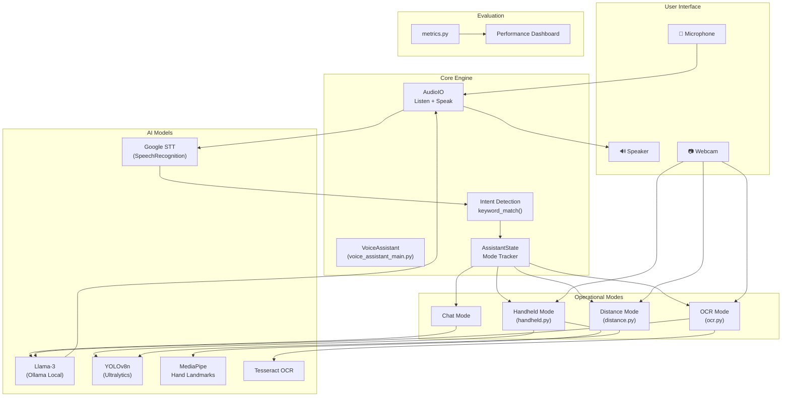
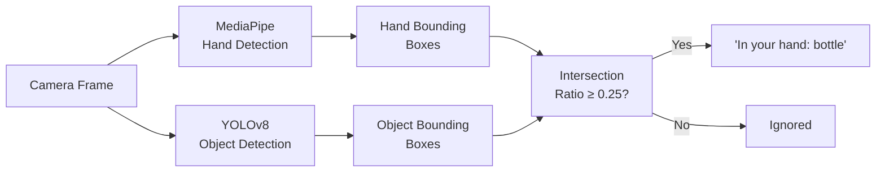
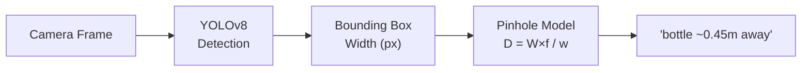
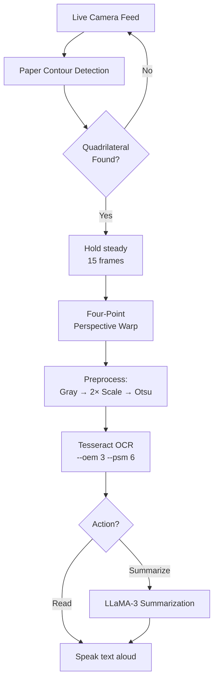
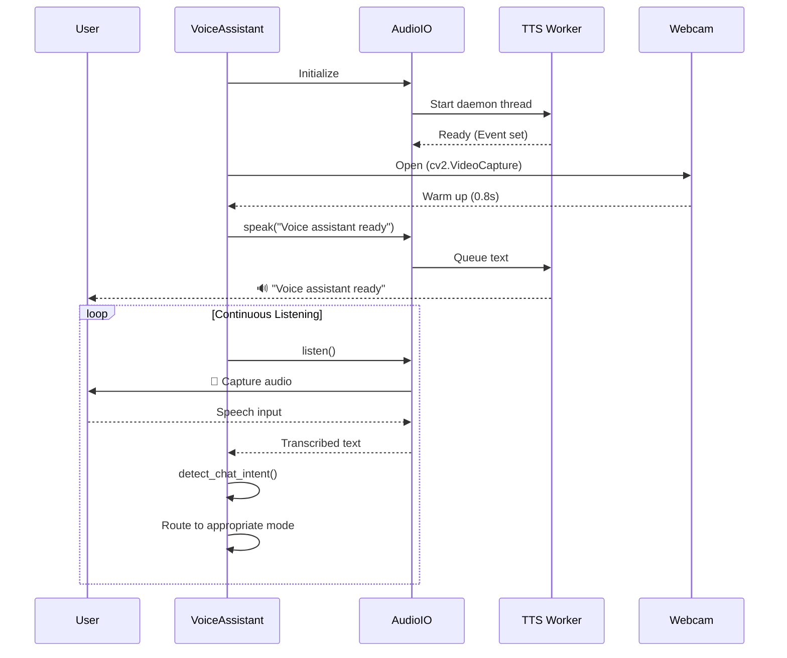
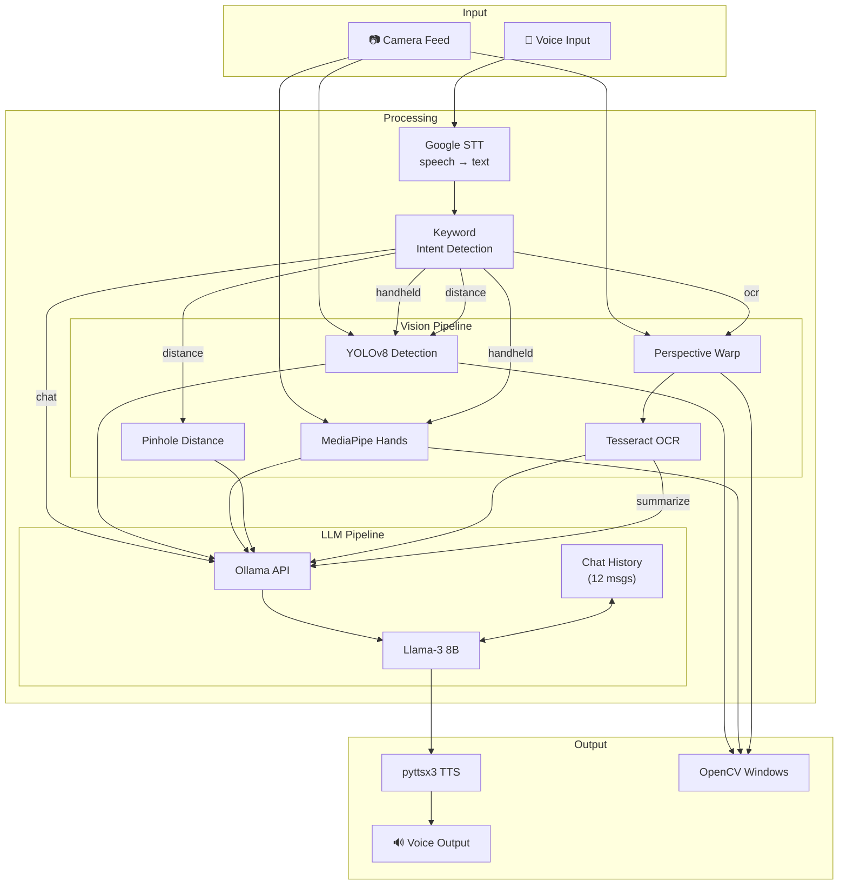

# VisionAssist — Multimodal AI Voice Assistant

## Complete Project Walkthrough

---

## 1. Abstract

**VisionAssist** is a real-time, voice-controlled, multimodal AI assistant designed to make visual information accessible through speech. The system continuously listens to the user via a microphone and seamlessly switches between four operational modes:

1. **Chat Mode** — General-purpose conversational Q&A powered by a local Llama-3 large language model (via Ollama).
2. **Handheld Detection Mode** — Identifies objects held in the user's hand using YOLOv8 object detection combined with MediaPipe hand tracking.
3. **Distance Estimation Mode** — Detects objects in the camera frame and estimates their physical distance using a pinhole camera model with YOLOv8.
4. **OCR Mode** — Automatically detects paper/documents in the camera feed, captures and perspective-corrects the image, extracts text via Tesseract OCR, and optionally summarizes it using Llama-3.

The assistant speaks all results aloud using text-to-speech (pyttsx3), creating a fully hands-free, eyes-free experience. The project also includes a comprehensive **performance evaluation framework** (`metrics.py`) that benchmarks all AI components — object detection (mAP, Precision, Recall), OCR quality (CER, WER), and summarization performance (ROUGE-1, ROUGE-2, ROUGE-L) — with a publication-ready dashboard.

Supplementary scripts demonstrate integration with cloud-based LLMs: **Google Gemini** (`gemini.py`) and **Mistral AI** (`mist.py`), providing alternative conversational backends.

> [!IMPORTANT]
> This project is a complete assistive technology system — not a proof-of-concept. It integrates five AI models/engines (YOLOv8, MediaPipe, Tesseract, Llama-3, Speech Recognition), handles real-time video, and includes a production-quality evaluation pipeline.

---

## 2. System Architecture



---

## 3. Project File Structure

```
VisionAssist/
├── voice_assistant_main.py   # 🏠 Main entry point — orchestrates everything
├── handheld.py               # ✋ Handheld object detection (YOLOv8 + MediaPipe)
├── distance.py               # 📏 Distance estimation mode (YOLOv8 + pinhole model)
├── ocr.py                    # 📄 Live camera OCR with auto paper detection
├── codex.py                  # 📄 Basic OCR utility (simpler, standalone)
├── metrics.py                # 📊 Full evaluation framework (1288 lines)
├── create_test_data.py       # 🧪 Test data generator for metrics evaluation
├── gemini.py                 # 🤖 Standalone Gemini voice assistant
├── gem.py                    # 🔑 Gemini API connectivity test
├── mist.py                   # 🔑 Mistral AI API connectivity test
├── keys.txt                  # 🔐 API key storage
├── requirements.txt          # 📦 Python dependency list
├── yolov8n.pt                # 🧠 YOLOv8-nano pre-trained weights (~6.5 MB)
├── hand_landmarker.task       # 🧠 MediaPipe hand landmark model (~7.8 MB)
├── visionassist_architecture.png  # 📐 Architecture diagram
├── performance_dashboard.png      # 📊 Generated performance dashboard
├── test_images/              # 🖼️ Detection test images
│   ├── Screenshot 2026-04-09 004505.png
│   └── test.jpeg
├── labels/                   # 🏷️ YOLO-format ground truth labels
│   ├── test_000.txt … test_002.txt
├── ocr_images/               # 🖼️ OCR test images
│   ├── ocr_000.png … ocr_002.png
├── ocr_labels/               # 📝 OCR ground truth text
│   ├── ocr_000.txt … ocr_002.txt
├── docs/                     # 📄 Source documents for summarization eval
│   └── doc_000.txt
├── refs/                     # 📄 Reference summaries for ROUGE evaluation
│   └── doc_000.txt
└── .venv/                    # 🐍 Python virtual environment
```

---

## 4. Libraries & Dependencies

| Library | Version | Purpose |
|---------|---------|---------|
| `SpeechRecognition` | 3.15.1 | Captures voice input via microphone; uses Google Web Speech API for STT |
| `pyttsx3` | 2.99 | Offline text-to-speech engine (SAPI5 on Windows) |
| `PyAudio` | 0.2.14 | Low-level audio I/O for microphone access |
| `requests` | 2.32.5 | HTTP client for Ollama REST API calls |
| `opencv-python` | 4.11.0.86 | Image/video capture, preprocessing, perspective transforms, GUI display |
| `pytesseract` | 0.3.13 | Python wrapper for Tesseract OCR engine |
| `ultralytics` | 8.4.26 | YOLOv8 model loading, inference, and post-processing |
| `mediapipe` | 0.10.14 | Real-time hand landmark detection (21 keypoints per hand) |
| `numpy` | 1.26.4 | Numerical operations, array manipulation, image processing |
| `matplotlib` | *(implicit)* | Performance dashboard visualization and plotting |
| `google-generativeai` | *(gemini.py)* | Google Gemini API client for cloud LLM |
| `mistralai` | *(mist.py)* | Mistral AI API client for cloud LLM |

### External Requirements

| Tool | Purpose |
|------|---------|
| **Ollama** | Local model server — hosts Llama-3 for chat, summarization |
| **Tesseract OCR** | System-level OCR engine — must be on PATH |
| **Webcam** | Live video feed for detection and OCR modes |
| **Microphone + Speaker** | Voice input and spoken output |

---

## 5. AI Models Used

### 5.1 YOLOv8-nano (Object Detection)

| Property | Value |
|----------|-------|
| **Model file** | `yolov8n.pt` (~6.5 MB) |
| **Architecture** | You Only Look Once v8 — nano variant |
| **Training data** | COCO dataset (80 object classes) |
| **Usage in project** | Handheld object detection + Distance estimation |
| **Inference** | Real-time per-frame detection in background threads |

YOLOv8n is the smallest and fastest variant, optimized for real-time inference on resource-constrained devices. It detects objects by dividing the image into a grid and predicting bounding boxes with class probabilities in a single forward pass.

### 5.2 MediaPipe Hands (Hand Tracking)

| Property | Value |
|----------|-------|
| **Model file** | `hand_landmarker.task` (~7.8 MB) |
| **Architecture** | MediaPipe multi-stage pipeline: palm detector + hand landmark model |
| **Output** | 21 3D landmarks per hand (wrist, fingertips, joints) |
| **Usage in project** | Determining bounding box of human hands for overlap calculation |
| **Config** | `max_num_hands=2`, `min_detection_confidence=0.5` |

MediaPipe uses a two-stage approach: first a lightweight palm detector finds hands in the frame, then a landmark regression model predicts 21 keypoints per detected hand. These keypoints are converted to bounding boxes with configurable margins.

### 5.3 Tesseract OCR (Text Extraction)

| Property | Value |
|----------|-------|
| **Engine mode** | OEM 3 (LSTM-based neural net) |
| **Page segmentation** | PSM 6 (Assume a single uniform block of text) |
| **Usage in project** | Extracting text from perspective-corrected paper images |
| **Preprocessing** | Grayscale → 2× upscale → Otsu binary threshold |

### 5.4 Llama-3 via Ollama (LLM)

| Property | Value |
|----------|-------|
| **Model** | `llama3` (Meta's Llama-3 8B) |
| **Server** | Ollama local REST API at `http://localhost:11434/api/chat` |
| **Usage in project** | General chat, handheld/distance context interpretation, OCR text summarization |
| **Context window** | Maintains rolling history of last 12 messages |

### 5.5 Google Speech Recognition (STT)

| Property | Value |
|----------|-------|
| **Provider** | Google Web Speech API (via `speech_recognition` library) |
| **Usage** | Continuous voice input transcription |
| **Config** | `timeout=4s`, `phrase_time_limit=8s`, ambient noise adjustment |

### 5.6 (Supplementary) Google Gemini 2.0 Flash

| Property | Value |
|----------|-------|
| **Model** | `gemini-2.0-flash` |
| **Usage** | Alternative cloud-based voice assistant (`gemini.py`) |
| **API** | `google-generativeai` SDK with multi-turn chat |

### 5.7 (Supplementary) Mistral Small

| Property | Value |
|----------|-------|
| **Model** | `mistral-small-latest` |
| **Usage** | API connectivity test (`mist.py`) |

---

## 6. Techniques Used

### 6.1 Computer Vision Techniques

#### Pinhole Camera Distance Estimation
```
Distance = (Known_Real_Width × Focal_Length_px) / Bounding_Box_Width_px
```
Used in `distance.py` with a lookup table of known object widths (e.g., person=0.45m, bottle=0.07m, laptop=0.35m). The camera's horizontal field of view (62°) is used to compute the focal length in pixels.

#### Perspective Warp (Four-Point Transform)
Used in `ocr.py` to rectify a detected paper quadrilateral into a flat rectangle. Steps:
1. Order the 4 corner points (TL, TR, BR, BL)
2. Compute output dimensions from max edge lengths
3. Apply `cv2.getPerspectiveTransform()` + `cv2.warpPerspective()`

#### Automatic Paper Detection
Uses edge detection pipeline:
1. Grayscale conversion
2. Gaussian blur (5×5 kernel)
3. Canny edge detection (thresholds: 30, 100)
4. Morphological dilation (3×3 kernel, 2 iterations)
5. Contour finding → filter for convex quadrilaterals ≥ 15% of frame area
6. Stability check: paper must be detected in 15 consecutive frames

#### Bounding Box Intersection Ratio
Used in `handheld.py` to determine if a detected object is "in the user's hand":
```
ratio = intersection_area(object_box, hand_box) / object_area
```
An object is considered handheld when `ratio ≥ 0.25` (25% overlap).

### 6.2 Natural Language Processing Techniques

#### Intent Detection (Keyword Matching)
A rule-based system that matches spoken utterances against predefined keyword lists to determine which mode to activate. Categories:
- **Handheld**: "what's in my hand", "handheld mode", etc.
- **Distance**: "how far", "detect objects", "distance mode", etc.
- **OCR Read**: "read this paper", "read this text", etc.
- **OCR Summarize**: "summarize this paper", "give me a summary", etc.
- **Quit/Exit**: "goodbye", "shutdown", "stop assistant", etc.

#### Conversational Context Management
The Llama-3 client maintains a rolling history of the last 12 messages (user + assistant), providing multi-turn conversational context. When tool results (detection, distance, OCR) are available, they are injected as supplementary system prompts.

#### Text Chunking for Speech
Long responses are split at sentence boundaries into chunks of ≤280 characters, optimized for natural TTS delivery.

### 6.3 Threading Model

The project uses a **multi-threaded architecture** to prevent blocking:

| Thread | Purpose |
|--------|---------|
| **Main thread** | Listening loop + intent routing |
| **TTS worker thread** | Dedicated `pyttsx3` engine (avoids COM/SAPI5 conflicts on Windows) |
| **Detection thread** | Continuous YOLOv8 + MediaPipe inference (handheld mode) |
| **Detection thread** | Continuous YOLOv8 distance estimation (distance mode) |

All inter-thread communication uses `queue.Queue` (thread-safe) and `threading.Lock` / `threading.Event` for synchronization.

### 6.4 Evaluation Techniques

#### mAP@0.5 (Mean Average Precision)
For object detection: predictions are sorted by confidence, matched to ground truth via IoU ≥ 0.5, and precision-recall curves are computed per class using COCO-style 101-point interpolation.

#### Levenshtein Edit Distance
Used for both CER (character-level) and WER (word-level) computation:
- **CER** = edit_distance(predicted_chars, gt_chars) / len(gt_chars)
- **WER** = edit_distance(predicted_words, gt_words) / len(gt_words)

Implemented from scratch using dynamic programming — no external metric libraries.

#### ROUGE Metrics
- **ROUGE-1**: Unigram overlap between generated and reference summaries
- **ROUGE-2**: Bigram overlap
- **ROUGE-L**: Based on longest common subsequence (LCS), space-optimized

All ROUGE metrics compute precision, recall, and F1. LCS uses a two-row DP approach for O(n) space complexity.

---

## 7. Module-by-Module Walkthrough

### 7.1 `voice_assistant_main.py` — Main Orchestrator (636 lines)

[voice_assistant_main.py](file:///c:/Users/Asus/Desktop/asdfadf/voice_assistant_main.py)

This is the **entry point** and the brain of the system. It contains four major classes:

#### `AudioIO` (Lines 206–282)
- Initializes pyttsx3 in a **separate daemon thread** to avoid COM conflicts
- `listen()` → captures mic audio → Google STT transcription
- `speak(text)` → chunks text → queues to TTS worker → blocks until spoken

#### `LlamaClient` (Lines 285–332)
- Dataclass wrapping the Ollama REST API (`http://localhost:11434/api/chat`)
- `generate_response()` → builds message array with system prompt + history + user message
- Sends HTTP POST to Ollama, parses JSON response
- Maintains rolling chat history (last 12 messages)

#### `AssistantState` (Lines 335–341)
- Simple dataclass tracking: `current_mode` (chat/handheld/distance/ocr), `ocr_text`, `ocr_action`

#### `VoiceAssistant` (Lines 344–626)
The main control class. Key methods:

| Method | Purpose |
|--------|---------|
| `run()` | Infinite listening loop — the main event loop |
| `handle_chat()` | Detects intent from speech and routes accordingly |
| `enter_handheld_mode()` | Initializes `HandheldMode`, starts background detection |
| `enter_distance_mode()` | Initializes `DistanceMode`, starts background detection |
| `enter_ocr_mode()` | Opens live camera preview, auto-captures paper, runs OCR |
| `respond_from_handheld()` | Gets detection description → sends to Llama-3 for natural response |
| `respond_from_distance()` | Gets distance description → sends to Llama-3 for natural response |
| `handle_active_mode()` | Routes speech to the currently active mode's handler |
| `stop_all_modes()` | Cleanly stops all background threads and resets state |

**Auto-announce feature**: When in camera modes (handheld/distance) and the user is silent, the system automatically speaks new detections with a 6-second cooldown.

---

### 7.2 `handheld.py` — Handheld Object Detection (274 lines)

[handheld.py](file:///c:/Users/Asus/Desktop/asdfadf/handheld.py)

Identifies what the user is holding by combining YOLOv8 and MediaPipe:



**Key logic:**
1. MediaPipe detects hand landmarks → converts to bounding box with 20px margin
2. YOLOv8 detects all objects (filters out `person` class)
3. For each detected object, computes intersection ratio with hand boxes
4. If ratio ≥ 25%, the object is classified as "handheld"
5. Background thread runs continuously, updating `_latest_description`

**Configuration:**
- `CONFIDENCE_THRESHOLD = 0.45`
- `HAND_OVERLAP_THRESHOLD = 0.25`
- `HAND_BOX_MARGIN = 20` pixels
- `COOLDOWN_SECONDS = 4`

---

### 7.3 `distance.py` — Distance Estimation Mode (249 lines)

[distance.py](file:///c:/Users/Asus/Desktop/asdfadf/distance.py)

Estimates physical distance to detected objects using a monocular camera:



**Distance estimation formula:**
```
focal_length_px = (frame_width / 2) / tan(HFOV / 2)
distance_m = (known_real_width × focal_length_px) / box_width_px
```

**Known object widths table** (selected):
| Object | Real Width (m) |
|--------|---------------|
| person | 0.45 |
| bottle | 0.07 |
| laptop | 0.35 |
| car | 1.80 |
| cell phone | 0.075 |

**Smart announcement logic** (standalone mode):
- Objects must be visible for ≥ 2 seconds before first announcement
- 6-second cooldown between announcements for the same object
- Re-announces only if distance changes by ≥ 0.7 meters

---

### 7.4 `ocr.py` — Live Camera OCR (373 lines)

[ocr.py](file:///c:/Users/Asus/Desktop/asdfadf/ocr.py)

A sophisticated OCR pipeline with automatic paper detection:



**Paper detection pipeline:**
1. Grayscale → Gaussian blur → Canny edge detection
2. Morphological dilation to close edge gaps
3. Find external contours → approximate to polygon
4. Select largest convex quadrilateral (≥ 15% of frame area)
5. Track stability: must appear in 15 consecutive frames
6. Visual feedback: progress bar overlaid on camera preview

**OCR preprocessing:**
- Convert to grayscale
- 2× bicubic upscale (improves small text recognition)
- Otsu's binary thresholding (adaptive to lighting conditions)

**Summarization:**
Sends extracted text to Llama-3 with the prompt:
> "Read the following OCR-extracted text and provide a concise summary in 3–4 sentences"

---

### 7.5 `codex.py` — Basic OCR Utilities (115 lines)

[codex.py](file:///c:/Users/Asus/Desktop/asdfadf/codex.py)

A simpler, standalone OCR module with utility functions:
- `preprocess_image()` — Same pipeline: gray → 2× resize → Otsu threshold
- `run_ocr_on_image()` — Run Tesseract on an in-memory image
- `scan_paper()` — OCR from a file path
- `scan_paper_from_camera()` — Single-frame camera capture + OCR
- `scan_paper_to_tempfile()` — Capture → save to temp → OCR (for debugging)

---

### 7.6 `metrics.py` — Performance Evaluation Framework (1288 lines)

[metrics.py](file:///c:/Users/Asus/Desktop/asdfadf/metrics.py)

A comprehensive, from-scratch evaluation system with **no external metric libraries**. Contains five major components:

#### Utility Functions
- **`levenshtein_distance()`** — Edit distance via full DP matrix (O(mn) time/space)
- **`lcs_length()`** — Longest Common Subsequence with space-optimized 2-row DP
- **`compute_iou()`** — Intersection over Union for YOLO-format normalized boxes

#### `ObjectDetectionEvaluator`
Evaluates YOLOv8 against YOLO-format ground truth labels:

| Metric | Description |
|--------|-------------|
| mAP@0.5 | Mean Average Precision at IoU threshold 0.5 |
| Precision | TP / (TP + FP) per class and overall |
| Recall | TP / (TP + FN) per class and overall |
| Avg latency | Per-image inference time |
| Confusion matrix | GT vs. predicted class pairs |

AP computation uses **COCO-style 101-point interpolation** of the precision-recall curve.

#### `OCREvaluator`
Evaluates Tesseract OCR output against ground truth text:

| Metric | Description |
|--------|-------------|
| CER | Character Error Rate (Levenshtein on characters) |
| WER | Word Error Rate (Levenshtein on words) |
| Avg latency | Per-image OCR time |

Text is normalized before comparison: lowercase → strip → remove punctuation → collapse whitespace.

#### `SummarizationEvaluator`
Evaluates Llama-3 summaries against reference texts using manually implemented ROUGE:

| Metric | Description |
|--------|-------------|
| ROUGE-1 | Unigram overlap (P, R, F1) |
| ROUGE-2 | Bigram overlap (P, R, F1) |
| ROUGE-L | LCS-based overlap (P, R, F1) |
| Length reduction | 1 − (summary_words / document_words) |

#### `PerformanceGrapher`
Generates a **2×4 publication-ready dashboard** using matplotlib:

| Row 1 | Handheld Detection | Scene-level Detection | OCR Summarization | End-to-end Latency |
|-------|------|------|------|------|
| Content | mAP, P, R bars | mAP, CER, WER bars | ROUGE F1 bars | Component comparison |

| Row 2 | Detection Latency | OCR Latency | Summarization Latency | Combined Box Plot |
|-------|------|------|------|------|
| Content | Histogram + stats | Histogram + stats | Histogram + stats | All components |

Also generates a **confusion matrix** heatmap for object detection.

#### `print_structured_summary()`
Prints a beautifully formatted terminal summary with box-drawing characters, organized into four categories.

---

### 7.7 `gemini.py` — Gemini Voice Assistant (272 lines)

[gemini.py](file:///c:/Users/Asus/Desktop/asdfadf/gemini.py)

A standalone, continuous voice assistant powered by **Google Gemini 2.0 Flash**:

| Component | Class | Description |
|-----------|-------|-------------|
| TTS Engine | `Speaker` | Thread-safe pyttsx3 wrapper (identical pattern to main assistant) |
| STT Input | `Listener` | Microphone capture + Google Web Speech API |
| LLM Backend | `GeminiChat` | Multi-turn chat with Gemini using `google-generativeai` SDK |

**Differences from main assistant:**
- No camera/vision modes — pure conversational AI
- Uses cloud API (Gemini) instead of local Ollama
- System prompt optimized for spoken output (avoids markdown, bullets)
- History management: trims to last 20 turns

---

### 7.8 `gem.py` + `mist.py` — API Test Scripts

Simple connectivity verification scripts:

- **`gem.py`** — Tests Google Gemini API with a single "Say API is working" prompt
- **`mist.py`** — Tests Mistral AI API with the same prompt
- Both print ✅ or ❌ based on success/failure

---

### 7.9 `create_test_data.py` — Test Data Generator (92 lines)

[create_test_data.py](file:///c:/Users/Asus/Desktop/asdfadf/create_test_data.py)

Generates synthetic test data for the metrics evaluation pipeline:

1. **Detection** — 3 images (640×640) with colored rectangles + YOLO-format labels
2. **OCR** — 3 images with rendered text ("Hello World", "Python 3", "OpenCV Test") + ground truth
3. **Summarization** — 1 document–reference pair about AI

---

## 8. End-to-End Workflow

### 8.1 Startup Sequence



### 8.2 Chat Mode Flow

```
User speaks → STT → intent = "chat" → LlamaClient.generate_response() 
→ Ollama REST API → Llama-3 → response text → chunk for speech → TTS → Speaker
```

### 8.3 Handheld Mode Flow

```
User: "What am I holding?"
→ intent = "handheld" 
→ enter_handheld_mode()
→ HandheldMode.start() [background thread begins]
→ Each frame: MediaPipe hands + YOLOv8 → intersection check
→ describe_object() → "I can see a bottle in your hand"
→ LlamaClient: "Camera result: bottle. User: what am I holding?"
→ Natural language response → TTS
```

### 8.4 Distance Mode Flow

```
User: "How far is that?"
→ intent = "distance"
→ enter_distance_mode()
→ DistanceMode.start() [background thread begins]
→ Each frame: YOLOv8 → pinhole distance estimation
→ get_distance_description() → "There is a laptop approximately 0.8 meters away"
→ LlamaClient: "Distance result: laptop 0.8m. User: how far?"
→ Natural language response → TTS
```

### 8.5 OCR Mode Flow

```
User: "Read this paper" or "Summarize this document"
→ intent = "ocr", action = "read" or "summarize"
→ enter_ocr_mode()
→ scan_paper_live() [opens camera preview window]
→ Auto-detect paper contour → hold steady 15 frames → capture
→ Perspective warp → preprocess → Tesseract OCR
→ If "read": speak extracted text in chunks
→ If "summarize": Llama-3 generates 3-4 sentence summary → speak
→ User can ask follow-up questions about the scanned text
```

### 8.6 Mode Switching

The assistant supports **seamless mode switching**:
- While in handheld mode, saying "how far" automatically stops handheld and starts distance mode
- Saying "quit" or "go back" returns to chat mode
- Saying "goodbye" or "shutdown" exits the entire application

---

## 9. Data Flow Diagram



---

## 10. Configuration Parameters

### Main Assistant (`voice_assistant_main.py`)

| Parameter | Value | Description |
|-----------|-------|-------------|
| `CAMERA_INDEX` | 0 | Default webcam device |
| `OLLAMA_URL` | `http://localhost:11434/api/chat` | Llama-3 API endpoint |
| `LLAMA_MODEL` | `"llama3"` | Ollama model name |
| `MAX_HISTORY_MESSAGES` | 12 | Rolling chat context window |
| `LISTEN_TIMEOUT` | 4 sec | Max silence before giving up |
| `PHRASE_TIME_LIMIT` | 8 sec | Max utterance duration |
| `TTS_RATE` | 170 wpm | Speech speed |
| `CAMERA_WARMUP_SECONDS` | 0.8 sec | Delay after opening camera |
| `AUTO_ANNOUNCE_COOLDOWN` | 6.0 sec | Minimum gap between auto-announcements |

### Handheld Mode (`handheld.py`)

| Parameter | Value | Description |
|-----------|-------|-------------|
| `CONFIDENCE_THRESHOLD` | 0.45 | Minimum detection confidence |
| `HAND_OVERLAP_THRESHOLD` | 0.25 | Min intersection ratio for "in hand" |
| `HAND_BOX_MARGIN` | 20 px | Padding around hand landmarks |
| `COOLDOWN_SECONDS` | 4 sec | Repeat announcement cooldown |

### Distance Mode (`distance.py`)

| Parameter | Value | Description |
|-----------|-------|-------------|
| `CONFIDENCE_THRESHOLD` | 0.60 | Higher threshold for distance mode |
| `CAMERA_HFOV_DEG` | 62.0° | Camera horizontal field of view |
| `SPEAK_COOLDOWN_SECONDS` | 6.0 sec | Announcement cooldown |
| `MIN_PRESENCE_SECONDS` | 2.0 sec | Object must be visible this long first |
| `DISTANCE_CHANGE_THRESHOLD_M` | 0.7 m | Re-announce only if distance changes this much |

### OCR Mode (`ocr.py`)

| Parameter | Value | Description |
|-----------|-------|-------------|
| `MIN_PAPER_AREA_RATIO` | 0.15 | Paper must fill ≥ 15% of frame |
| `STABLE_FRAMES_REQUIRED` | 15 | Frames of stability before auto-capture |
| `CONTOUR_APPROX_EPSILON` | 0.02 | Polygon approximation tolerance |
| `CANNY_LOW / CANNY_HIGH` | 30 / 100 | Edge detection thresholds |

---

## 11. Evaluation Pipeline

### Running Evaluations

```bash
# Generate test data (if needed)
python create_test_data.py

# Run all evaluations with dashboard
python metrics.py --task all --graph

# Run individual evaluations
python metrics.py --task detection --images ./test_images --labels ./labels
python metrics.py --task ocr --ocr-images ./ocr_images --texts ./ocr_labels
python metrics.py --task summarization --inputs ./docs --references ./refs
```

### Evaluation Output

The evaluation produces:
1. **Terminal summary** — Structured box-drawing table with all metrics
2. **Performance dashboard** — 2×4 matplotlib figure saved as `performance_dashboard.png`
3. **Confusion matrix** — Heatmap for detection evaluation

### Metrics Summary

| Component | Metrics | Implementation |
|-----------|---------|----------------|
| Object Detection | mAP@0.5, Precision, Recall, Latency | IoU matching + 101-pt AP interpolation |
| OCR | CER, WER, Latency | Levenshtein distance (DP) |
| Summarization | ROUGE-1/2/L, Length reduction, Latency | N-gram overlap + LCS |

---

## 12. How to Run the Project

### Prerequisites

```bash
# 1. Install Python dependencies
pip install -r requirements.txt

# 2. Install and start Ollama with Llama-3
ollama pull llama3
ollama serve

# 3. Ensure Tesseract OCR is installed and on PATH
# Download from: https://github.com/tesseract-ocr/tesseract
```

### Running the Main Assistant

```bash
python voice_assistant_main.py
```

### Running the Gemini Voice Assistant

```bash
# Set API key (or hardcode in gemini.py)
set GEMINI_API_KEY=your-key-here
python gemini.py
```

### Voice Commands Reference

| Command | Action |
|---------|--------|
| *"What am I holding?"* | Enter handheld detection mode |
| *"How far is that?"* | Enter distance estimation mode |
| *"Read this paper"* | Enter OCR mode (read aloud) |
| *"Summarize this document"* | Enter OCR mode (summarize) |
| *"Stop handheld" / "quit"* | Exit current mode → chat |
| *"Goodbye" / "shutdown"* | Exit the assistant entirely |
| *(Any other speech)* | General chat with Llama-3 |

---

## 13. Key Design Decisions

1. **Local-first AI** — Llama-3 runs locally via Ollama, ensuring privacy and offline capability. No data leaves the machine for the core pipeline.

2. **Thread-safe TTS** — pyttsx3 is notoriously problematic with threading on Windows (COM/SAPI5). The project solves this by initializing the engine in a dedicated worker thread with queue-based message passing.

3. **Graceful fallbacks** — MediaPipe import failures are caught and stored (`_MEDIAPIPE_IMPORT_ERROR`); handheld mode degrades gracefully. Camera failures are handled with user-facing voice messages.

4. **From-scratch metrics** — The evaluation pipeline implements Levenshtein, LCS, IoU, ROUGE, and mAP entirely from scratch without external metric libraries, demonstrating deep understanding of the algorithms.

5. **Modular architecture** — Each vision mode is encapsulated in its own class (`HandheldMode`, `DistanceMode`) with `start()` / `stop()` / `describe()` / `get_description()` interfaces, making them independently testable and hot-swappable.

6. **Auto-announce with deduplication** — In camera modes, the system proactively speaks new detections without waiting for the user to ask, but deduplicates via cooldown timers and content comparison.
